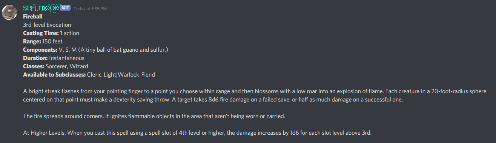
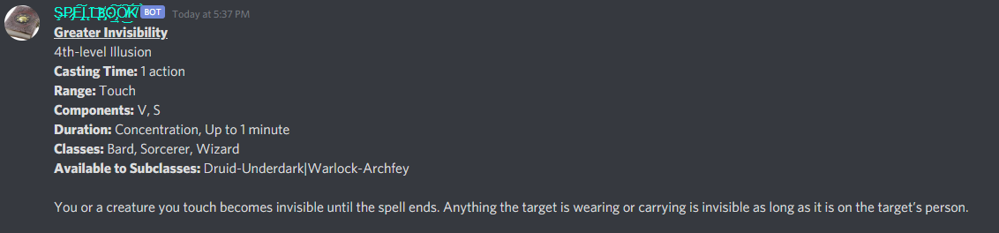
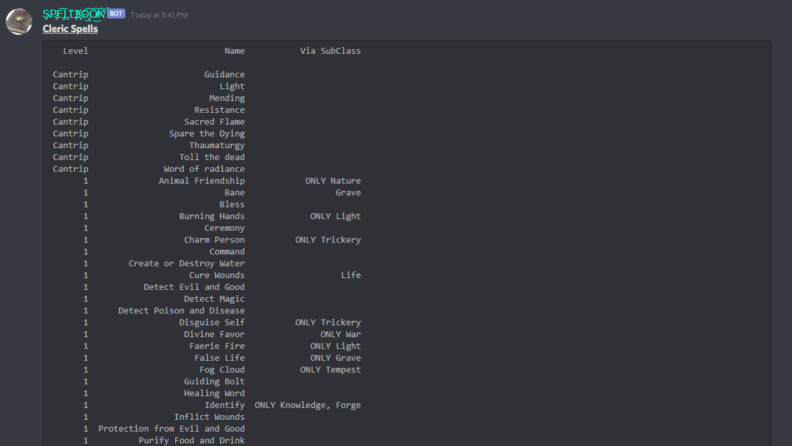
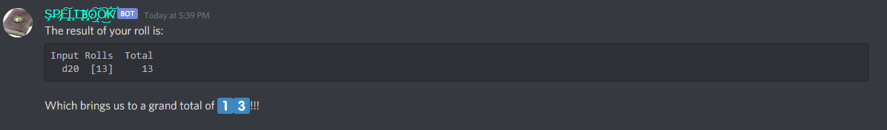
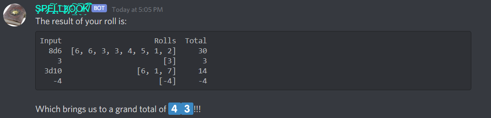

# Spellbook
Spellbook is a Discord bot that contains tools for Dungeons & Dragons(D&D) players and dungeon masters. This includes but is not limited to the ability to pull information about spells, dicerolling, and playing youtube audio in a voice channel.
## Motivation
I play D&D and would rather have direct control of services being used for our telecomm sessions. In addition, I wanted to strengthen my skills as a programmer as I am looking to begin working as a developer.
## Languages
Python is the primary language being used; however, I am using SQLite3 for the databasing of information and so SQL is used to some degree.
## Libraries
| Library | Description/Usage |
| ----------- | ----------- |
| [discord.py](https://discordpy.readthedocs.io/en/latest/#) | Connecting into the Discord API. I prefer using the extension [commands](https://discordpy.readthedocs.io/en/latest/ext/commands/commands.html) as it allows for easier coding. |
| [sqlite3](https://docs.python.org/2/library/sqlite3.html) | Accessing SQLite3 databases |
| [youtube_dl](https://pypi.org/project/youtube_dl/) | Pulling Youtube audio |
| [pandas](https://pandas.pydata.org/) | Displaying information in a tidy table |
| [random](https://docs.python.org/3/library/random.html) | Used to generate random results. Heavily used in diceRolling. |
| [re](https://docs.python.org/3/library/re.html) | Regular Expressions |
| [logging](https://docs.python.org/2/library/logging.html) | Logging of activity

I might be missing some as I'm still actively working on it, but those are the primary libraries that will be needed.
## Getting Started
The first thing you need to do is get Python setup if you want to run this bot. I am using Python 3.8.2. There are guides galore on the internet for that.

You will then need to create generate a bot token with Discord. This guide can be used to figure that part out. Once you have the token, create a ".env" file on the top layer of the repo and put the token there. There is a ".env.sample" file in the repo that can be used as an example.

You will also need to have a SQLite3 database that contains all of the D&D related information. Unfortunately I cannot post my DB here as it would break copyright laws. In the future, I will post a guide on how to create your own including schema and the such.

There are some features that require access to custom emojis that the bot would have access to due to the channels to which it belongs. 
## Discord Commands
Keep in mind that all commands via Discord will begin with "!" as that is the invocation set in config.py. This can be adjusted if you'd like.
### **spell**
This command will pull back information for the specified spell. The command is:
```
!spell [name of spell]
```

```
!spell fireball
```
RESPONSE:

**Wildcard**: You can use "%" to wildcard your input.
```
!spell Greater Inv%
```

Because there is only one spell that starts with "Greater Inv", it will return the information for "Greater Invisibility". If the wildcard can refer to more than one spell, at the moment it will return the one that would appear first in the DB. I will be adding in "clarification logic" later.
### **spellList**
This command will pull back all spells for a specified class. The command is:
```
!spellList [name of class]
```
```
!spellList cleric
```

This command will only work if you input the name of a class.
### **roll**
This command will roll dice for you based on what you feed into it.

```
!roll D20
```

The bot will respond with the result of a D20 being rolled. You can also include modifiers, change the number of dice being rolled, and add in other dicerolls using "+" as the seperator(spaces are ignored):
```
!roll 8d6 + 3 + 3D10 - 4
```
RESPONSE:


**MORE COMING SOON!**